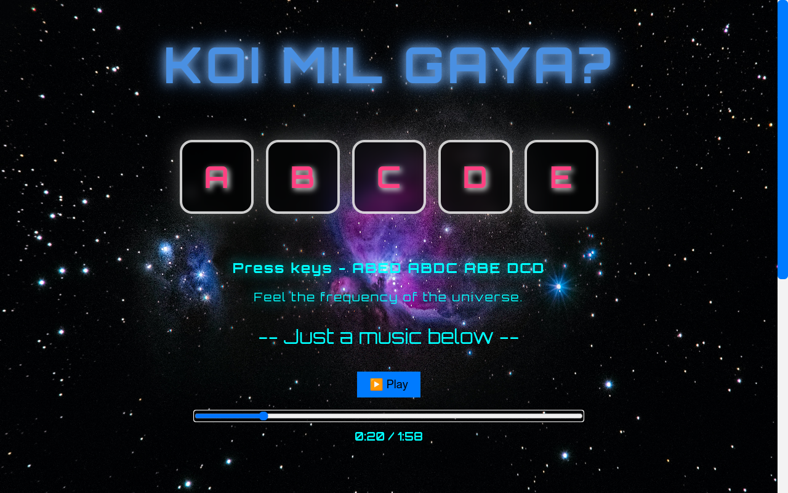

# KoiMilGaya

# 🛸 Alien Sound Player

A fun web-based project where different keys trigger alien sound effects, with a built-in background music player and progress bar. Built using **HTML, CSS, and JavaScript**.

## 🌐 Live Demo
[Check it out here!](https://sahil-js.github.io/KoiMilGaya)


---

## 🎯 Features
- 🎹 **Play Sounds:** Press keys `A, B, C, D, E` to play different alien sounds.
- 🎵 **Background Music:** Play and pause music with a button.
- 📊 **Progress Bar:** Visual progress bar to track music playback.




---

# 🎵 Alien Tune with a Piano Version

## How to Change the Tune from Alien Tune to Piano

If you want to change the current Alien tune to a piano version (which is also good by the way), follow these simple steps:

1. **Open the `index.js` file**  
   This is where the sound mappings are defined.

2. **Find the section where the `soundMap` object is defined.**  
   In the `index.js` file, you will see a block of code like this:

   ```javascript
   const soundMap = {
       "a": "sounds/Alien/A.mp3",
       "b": "sounds/Alien/B.mp3",
       "c": "sounds/Alien/C.mp3",
       "d": "sounds/Alien/D.mp3",
       "e": "sounds/Alien/E.mp3"
   };

3. **Change the soundMap object to the following code to switch to piano sounds:**
  ```javascript
  const soundMap = {
    "a": "sounds/Piano/A.mp3",
    "b": "sounds/Piano/B.mp3",
    "c": "sounds/Piano/C.mp3",
    "d": "sounds/Piano/D.mp3",
    "e": "sounds/Piano/E.mp3"
};

4. **Save the script.js file.**
5. **The sounds for the keys 'a', 'b', 'c', 'd', and 'e' will now play piano notes instead of the alien calling sounds.**